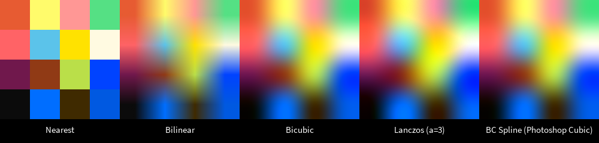
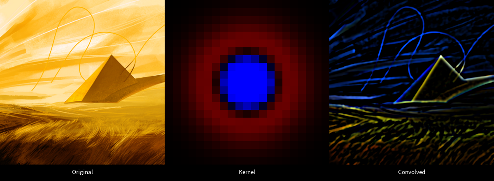

**sampleutils** is an image resampling, filtering, and utility library for [Processing](https://processing.org/).

Note: This is a WIP; I'm cobbling together this library from various functions and utility scripts I've written over the years. First release should be out soon.

## Features
### Supported
#### Interpolation/Resampling
* Nearest-neighbor interpolation (no interpolation)
* Bilinear interpolation
* Bicubic interpolation
* Mitchell-Netravali filters (BC-splines)
* Lanczos resampling
* EXX2 upscaling
* Poisson disk generation
* Sunflower disk generation
#### Filters
* Circular medioid blurring
* Inversion
* Kernel filters (convolutions)
* Bivariate Gaussian blurs

### Planned:
#### Interpolation/Resampling
* Box filtering
* Gaussian fitlering
* FFT methods
* CNN-based/DLSS-style upscaling (probably beyond project scope)
#### Filters
* Unsharp masking / local contrast enhancement
* Tone mapping
* Gamut Masking / clipping
* Dithered curve adjustment
* Component extraction
* Saturation/luma/chromaticity, etc.
* LUT extraction from image pairs
#### Quantization/Dithering
* Error diffusion matrix-based methods
* Blue noise
* Bayer matrices
* Feature-aware methods

